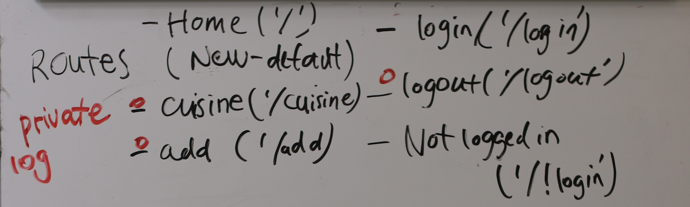

# FACN Recipe 2.0
The new and improved facnrecipe.
A simple recipe application for members of Founders & Coders community in Nazareth.

### To get started:
Click [here](https://facnrecipe2.herokuapp.com/) to use FACN Recipe 2.0.

Or you can clone this repository.
```
git clone
```
Install the dependencies
```
npm i
```
Run start
```
npm run devStart
```

### User story:
As a student/mentor of Founders & Coders based in Nazareth, she/he can...
+ login securely to the app
+ create a new recipe
+ browse available recipes
+ filter recipes by origin food type
+ view the most recent recipes

### Schema
**recipes**

| id  | recipe_name    | ingredients | directions | origin | user_id |
| --- | ------------ | ------ | -------- | ------- | ------- |

**users**

| id  |  username | password | name | surname | email |
| --- |:-----:|:-----:|:-----:|:-------:|:-----:|


### Wireframe

[GO CHECK OUR WIREFRAME HERE](https://xd.adobe.com/embed/980d4206-8467-49ba-a9ed-f407de6e7149/)

### Architecture


### To do list:   
- [x] create repository
- [x] create file structure
- [x] create wireframe
- [x] create architecture diagram
- [x] write this beautiful readme :tada:
- [x] create server, router and handler
  - test the routes
  - refactor
- [x] create the database
- [x] create the login and sign up forms
- [x] hash passwords and store in database
- [x] create token and save in cookie
- [ ] try login
- [ ] attempt the stretch goals

### Stretch goals
- Function for editing/deleting recipes only for the user that created the original recipe
- Admin authentication to edit/delete any recipes

### Rules
- All branches should be understood and reviewed by all team members prior to pushing/merging to master
- Writing core functionality as a three but splitting up when team members feel comfortable
- All team members must review before a branch is merged
